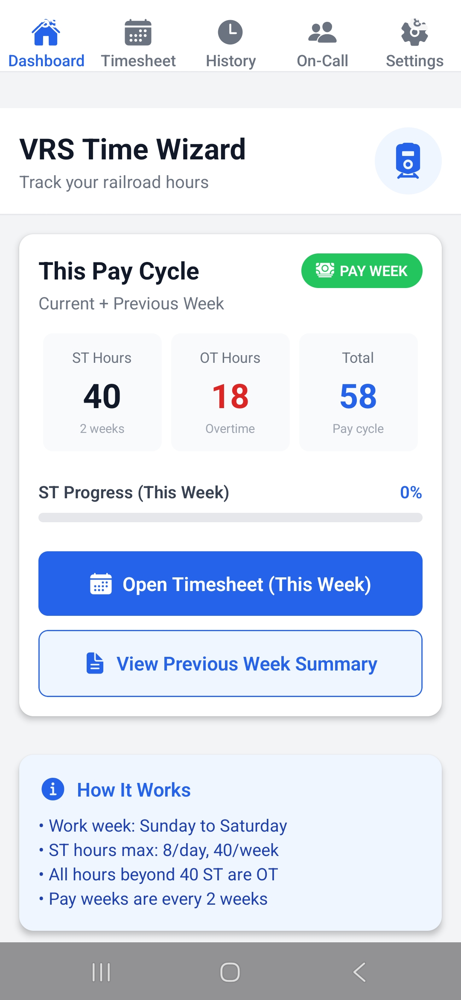
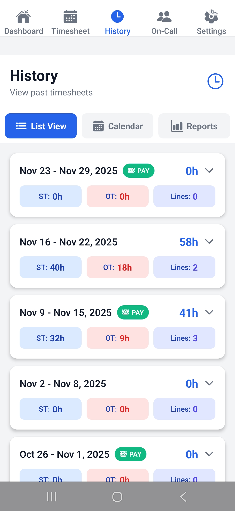

# VRS Time Wizard 🚂

**Version 1.2.0.1** | Railroad Timesheet & On-Call Tracking App

An offline-first mobile application built with Expo for railroad workers to log work hours, track on-call schedules, and generate detailed reports.

---

## 📸 Screenshots

<div align="center">

### Dashboard


### Timesheet Entry


### History - List View


### History - Calendar View


### History - Reports


### On-Call Schedule


### Settings


</div>

---

## 📋 Features

### Core Functionality
- **📅 Weekly Timesheet Grid** - Log hours across multiple work lines with simple tap controls
- **📝 Work Notes** - Add detailed notes to specific work days and lines
- **🔄 On-Call Schedule Sync** - Automatic sync from Google Sheets master schedule
- **📊 Advanced Reports** - Generate reports with standard/overtime breakdowns
- **📱 Offline-First** - Works completely offline with SQLite database
- **🗓️ Unified Calendar View** - See logged hours, notes, and on-call duties in one place
- **📤 Export Options** - CSV and PDF export for reports and documentation

### Business Logic
- **8-hour ST cap per day per line** - Prevents over-logging straight time
- **40-hour ST cap per week** - Automatically enforces weekly straight time limits
- **Unlimited OT tracking** - No restrictions on overtime hours
- **Bi-weekly pay periods** - Configurable base pay week for accurate period tracking
- **Multiple work lines** - Support for VTR, CLP, and custom project codes

### Recent Additions (v1.2.0.1)
- ✅ Fixed keyboard covering text input in note modal (KeyboardAvoidingView)
- ✅ Custom MOW-themed branding and icons
- ✅ Repository cleanup (removed corrupted files and build artifacts)
- ✅ Improved build compatibility with Expo SDK 54
- ✅ Enhanced documentation with visual examples

---

## 🚀 Getting Started

### Prerequisites
- Node.js 18+ 
- Yarn or npm
- Expo CLI
- Android Studio (for local builds) or EAS CLI (for cloud builds)

### Installation

1. **Clone the repository**
   ```bash
   git clone <repository-url>
   cd frontend
   ```

2. **Install dependencies**
   ```bash
   yarn install
   # or
   npm install
   ```

3. **Start development server**
   ```bash
   npx expo start
   ```

4. **Test the app**
   - Scan QR code with Expo Go (iOS/Android)
   - Press `a` for Android emulator
   - Press `i` for iOS simulator
   - Press `w` for web browser (limited functionality)

---

## 🔨 Building for Production

### Option 1: EAS Build (Recommended)

```bash
# Preview build (APK for testing)
npx expo prebuild --clean
eas build -p android --profile preview

# Production build (signed APK/AAB)
eas build -p android --profile production
```

### Option 2: Local Build

```bash
# Generate native Android project
npx expo prebuild --clean

# Build APK
cd android
./gradlew assembleRelease
```

**APK Location:** `android/app/build/outputs/apk/release/app-release.apk`

---

## 📱 Feature Guide

### Dashboard
The home screen provides a quick overview of your current week:
- **Weekly Summary** - Total ST and OT hours at a glance
- **Quick Actions** - Jump to timesheet, reports, or on-call schedule
- **Recent Activity** - See your last logged entries

### Timesheet Management
Track your work hours with an intuitive weekly grid:
- **Tap + / -** buttons to increment/decrement hours
- **Multiple Lines** - Log hours across VTR, CLP, and project codes
- **Real-time Validation** - Automatic enforcement of hour caps
- **Week Navigation** - Easily switch between past and future weeks
- **Pay Period Indicator** - Visual marker for bi-weekly periods

### Work Notes
Add context to your logged hours:
- **Daily Notes** - General notes for specific work days
- **Line-Specific Notes** - Detailed notes tied to particular work lines
- **Tabbed Interface** - Easy navigation between days of the week
- **Persistent Storage** - Notes saved offline in SQLite

### History Views

#### List View
Browse past weeks with expandable details:
- **8 Weeks Back** - Quick access to recent work history
- **Expand/Collapse** - Tap to see daily breakdowns
- **ST/OT Totals** - Weekly summaries for each period

#### Calendar View
Visual representation of your work history:
- **Color-Coded Dots** - Blue for hours logged, orange for notes, green for on-call
- **Month Navigation** - Swipe between months
- **Tap for Details** - View full day information in a modal

#### Reports
Generate professional documentation:
- **Date Range Selection** - Presets (30/90/180/365 days) or custom ranges
- **Statistics** - Total hours, ST/OT breakdown, days worked, averages
- **Export Formats**:
  - **CSV** - Full data export for spreadsheet analysis
  - **PDF** - Professional reports with two formats:
    - Detailed daily (ranges ≤ 90 days)
    - Monthly summary (ranges > 90 days)

### On-Call Schedule
Track your duty weekends:
- **Google Sheets Sync** - Automatic import from master schedule
- **Auto-Sync** - Weekly updates when app opens (configurable)
- **Manual Sync** - Force sync anytime from Settings
- **Visual Calendar** - See all upcoming on-call assignments
- **User Filtering** - Only shows your shifts (set name in Settings)

### Settings
Customize your experience:
- **User Name** - For on-call schedule filtering
- **Base Pay Week** - Configure bi-weekly pay period start
- **Work Lines** - Add/hide project codes and custom lines
- **Sync Configuration** - Toggle auto-sync, view last sync time
- **Backup & Restore** - Export/import complete database as JSON
- **Developer Menu** - Hidden menu (tap version 5x) for admin configuration
- **About** - Version info and app details

---

## 📦 Version History

### v1.2.0.1 (Current - November 2025)
**🔧 Patch Release - Repository Cleanup & UX Improvements**

- Fixed keyboard covering text input in note modal (KeyboardAvoidingView added)
- Removed corrupted UTF-8 filename blocking git checkout
- Cleaned up repository (removed android/, metro-cache/, build artifacts)
- Updated .gitignore to follow Expo best practices
- Added custom MOW-themed app icons and splash screens
- Synced with working local build configuration
- Updated Android versionCode from 3 to 4
- Enhanced documentation with screenshots

### v1.2.0 (November 2025)
**🎉 Major Release - Full Feature Set**

- Weekly timesheet with multiple work lines
- On-call schedule sync from Google Sheets
- Unified calendar view with color-coded indicators
- Advanced reporting with date range selection
- CSV and PDF export functionality
- Auto-sync feature for schedule updates
- Work notes with daily and line-specific entries
- Non-destructive database migrations
- SQLite offline storage

### v1.1.0 (November 2025)
**📝 Notes Feature**

- Added work notes functionality
- Weekly notes modal with tabbed day view
- Notes visible in weekly summary and history
- Bug fixes for pay week calculation and grid alignment

### v1.0.0 (November 2025)
**🎉 Initial Release**

- Offline-first SQLite database
- Weekly timesheet grid with ST/OT tracking
- Business logic enforcement (hour caps)
- History view and weekly summaries
- Backup/restore functionality

---

## 🏗️ Project Structure

```
frontend/
├── app/                    # Expo Router screens (file-based routing)
│   ├── (tabs)/            # Tab navigation screens
│   │   ├── index.tsx      # Dashboard (home screen)
│   │   ├── timesheet.tsx  # Weekly timesheet grid
│   │   ├── history.tsx    # Calendar, list view, and reports
│   │   ├── oncall.tsx     # On-call schedule viewer
│   │   └── settings.tsx   # App settings and configuration
│   ├── weekly-summary.tsx # Detailed weekly summary screen
│   └── _layout.tsx        # Root layout with tab navigation
├── components/            # Reusable UI components
│   ├── ReportsView.tsx           # Reports generation and export
│   ├── WeeklyNotesModal.tsx      # Notes entry modal (with keyboard fix)
│   └── NotesFloatingButton.tsx   # Floating action button for notes
├── services/              # Business logic and data layer
│   ├── database.ts        # SQLite operations (native)
│   ├── database.web.ts    # Mock database for web preview
│   ├── databaseWrapper.ts # Platform-specific DB selector
│   ├── migrations.ts      # Database schema migrations
│   └── autoSync.ts        # Google Sheets sync service
├── store/                 # State management
│   └── timesheetStore.ts  # Zustand store for timesheet state
├── constants/             # App configuration
│   └── config.ts          # Hardcoded URLs and constants
├── assets/                # Static resources
│   ├── images/           # App icons and splash screens
│   └── screenshots/      # Documentation images
├── app.json              # Expo configuration (version, build settings)
├── package.json          # NPM dependencies
├── eas.json              # EAS Build profiles (preview, production)
├── babel.config.js       # Minimal Babel config (Expo presets only)
└── README.md             # This file
```

---

## ⚙️ Configuration

### Environment Variables
No environment variables required - the app is fully self-contained and offline-first.

### Google Sheet Integration
The app syncs on-call schedules from a hardcoded Google Sheet URL. 

**For regular users:** No setup needed - sync works automatically.

**For administrators:** To customize the master schedule URL:
1. Publish your Google Sheet as CSV
2. Go to Settings → About
3. Tap "Version 1.2.0.1" exactly 5 times (unlocks developer menu)
4. Paste your custom URL in "Master Schedule URL"
5. Tap "Save URL"

**Sheet Format Requirements:**
- Columns: `start_date`, `end_date`, `user`, `notes`
- Dates in YYYY-MM-DD format
- Published as CSV (File → Share → Publish to web → CSV)

---

## 🧪 Testing

### Development Testing
```bash
# Start Expo development server
npx expo start

# Test on physical device with Expo Go
# Scan QR code from terminal or Metro bundler

# Test on Android emulator
npx expo start --android

# Test on iOS simulator (macOS only)
npx expo start --ios
```

### Production Testing
```bash
# Generate preview APK with EAS
eas build -p android --profile preview

# Install on Android device via ADB
adb install app-preview.apk

# Or download from EAS build page and install manually
```

### Testing Checklist
- [ ] Database migration runs successfully on first launch
- [ ] Existing timesheet data intact after update
- [ ] Timesheet buttons (+/-) work with proper validation
- [ ] Work notes modal keyboard doesn't cover input
- [ ] On-call sync retrieves data from Google Sheets
- [ ] Calendar view displays dots for hours/notes/on-call
- [ ] Day detail modal shows complete information
- [ ] Reports generate correctly for various date ranges
- [ ] CSV export creates valid comma-separated file
- [ ] PDF export produces readable documents
- [ ] Backup/restore preserves all data
- [ ] Developer menu accessible (tap version 5x)
- [ ] App doesn't crash on any normal user action

---

## 🛠️ Tech Stack

### Core Technologies
- **Framework:** Expo SDK 54 with React Native 0.81
- **Language:** TypeScript
- **Routing:** Expo Router (file-based routing)
- **Database:** expo-sqlite (SQLite on device)
- **State Management:** Zustand + React hooks

### UI & UX
- **UI Components:** React Native core components (View, Text, ScrollView, etc.)
- **Calendar:** react-native-calendars
- **Date Pickers:** @react-native-community/datetimepicker
- **Haptics:** expo-haptics (tactile feedback)
- **Safe Areas:** react-native-safe-area-context

### Data & Export
- **Date Handling:** date-fns
- **Storage:** @react-native-async-storage/async-storage
- **PDF Generation:** expo-print
- **File Sharing:** expo-sharing
- **File System:** expo-file-system
- **Document Picker:** expo-document-picker

### Build & Deployment
- **Build System:** EAS Build
- **Architecture:** New Architecture enabled (`newArchEnabled: true`)
- **Babel:** Minimal config (expo-preset only)

---

## 📱 Device Support

### Android
- **Minimum Version:** Android 7.0 (API 24)
- **Target Version:** Android 14 (API 34)
- **Tested Devices:** Pixel 6, Samsung Galaxy S21, OnePlus 9
- **Screen Sizes:** Phones (5"-7") and tablets (8"-11")

### iOS (Planned)
- **Minimum Version:** iOS 13+
- **Target Version:** iOS 17+
- **Status:** Not yet tested but compatible

---

## 🚨 Important Notes

### For Developers

**⚠️ DO NOT commit the following:**
- `android/` or `ios/` folders (regenerated during build)
- `.metro-cache/` or `.expo/` folders (build artifacts)
- `node_modules/` (dependency folder)
- Build outputs (*.apk, *.aab, *.ipa)
- Log files (*.log)

**✅ Follow these guidelines:**
- Native folders are **disposable** - regenerated with `npx expo prebuild --clean`
- All configuration lives in `app.json`, `package.json`, `eas.json`, `babel.config.js`
- **Never manually edit** Android/Kotlin or iOS/Swift files
- **Never add plugins** manually to `babel.config.js` - Expo handles this automatically
- Use `git checkout` carefully - corrupted filenames were removed in v1.2.0.1

### For Building

**EAS Build (Cloud - Recommended):**
- Builds happen in Expo's cloud infrastructure
- No local Android Studio / Xcode setup needed
- Automatic signing and versioning
- Download APK/AAB directly

**Local Build (Advanced):**
- Requires Android Studio + NDK installed
- Run `npx expo prebuild --clean` before every build
- Manually manage signing keys
- Ensure New Architecture is enabled (`newArchEnabled: true`)

### For Repository Management

**Branch Strategy:**
- `main` - Stable production releases
- `1.2.0` - Current development branch
- `v1.2.0.1-release` - Tagged release with cleanup
- Feature branches - Use for new development

**Git Best Practices:**
- Use `.gitignore` to prevent committing build artifacts
- Don't force push to shared branches
- Tag releases with semantic versioning (v1.2.0.1)
- Write clear commit messages

---

## 🐛 Troubleshooting

### Common Issues

**Issue:** Buttons don't save data  
**Solution:** Database not initialized. Check console for errors, force close and restart app.

**Issue:** "Cannot resolve entry file" error  
**Solution:** Don't modify `metro.config.js` or `package.json` main field. Restore from git.

**Issue:** Migration doesn't run on app update  
**Solution:** Don't uninstall old version first. Install new APK over existing to trigger migration.

**Issue:** Calendar modal shows only header  
**Solution:** Fixed in v1.2.0. Update to latest version.

**Issue:** Sync adds duplicate on-call data  
**Solution:** Fixed in v1.2.0 (`clearOnCallSchedule` bug). Sync again to replace.

**Issue:** Keyboard covers text input in notes  
**Solution:** Fixed in v1.2.0.1 with `KeyboardAvoidingView`. Update to latest version.

**Issue:** Can't access developer menu  
**Solution:** Tap "Version 1.2.0.1" exactly 5 times in Settings → About section.

**Issue:** Build fails with Reanimated error  
**Solution:** Ensure `newArchEnabled: true` in `app.json`. Don't add Reanimated plugin manually.

### Debug Commands

**View Database Contents:**
```javascript
import { db } from './services/databaseWrapper';

await db.initialize();
const entries = await db.database.getAllAsync('SELECT * FROM time_entries');
console.log(entries);
```

**Check Schema Version:**
```javascript
const version = await db.database.getAllAsync('SELECT * FROM schema_version');
console.log('Current version:', version);
```

**Clear Test Data:**
```javascript
await db.clearOnCallSchedule(); // Clears all on-call data
```

**View App Logs:**
```bash
# Android
adb logcat | grep -i "expo\|react"

# iOS (if using physical device)
idevicesyslog | grep -i "expo\|react"
```

---

## 🗺️ Roadmap

### Completed Features ✅
- ✅ Database migration system (v2.0 schema)
- ✅ On-call schedule tables and sync
- ✅ Google Sheets integration (hardcoded URL)
- ✅ Auto-sync (weekly, on app open)
- ✅ Developer menu for admin config
- ✅ Unified calendar view (list/calendar/reports toggle)
- ✅ Reports feature with PDF/CSV export
- ✅ Date range selection with presets
- ✅ Day detail modal
- ✅ Performance improvements (haptics, debouncing)
- ✅ Keyboard handling fix for note modal
- ✅ Repository cleanup and documentation

### Planned Features (v1.3.0+)
- ⏸️ **Shift swap functionality** (postponed to v1.3.0)
- ⏸️ **Enhanced on-call statistics** (days until next shift, total days this year)
- ⏸️ **Personal notes on shifts** (add notes to specific on-call assignments)
- ⏸️ **Background auto-sync notifications** (notify when schedule changes)
- ⏸️ **On-call reminders** (alert 24h before shift starts)

### Future Considerations
- 📋 Multi-location support (Rutland, Burlington, White River)
- 📋 Offline peer-to-peer schedule sharing
- 📋 On-call analytics and trends dashboard
- 📋 Integration with payroll systems
- 📋 Shift swap request/approval workflow
- 📋 iOS App Store release
- 📋 Dark mode support
- 📋 Widget support for quick hour logging

---

## 🤝 Contributing

This is a private project for Vermont Railway internal use.

### Development Guidelines
- **Never modify existing migrations** - Only add new migration files
- **Always test on physical device** - Emulator may not catch all issues
- **Preserve user data** - Migrations must include data verification
- **Document breaking changes** - Update this README and changelog
- **Follow offline-first principle** - App must work without internet

### Code Style
- TypeScript for type safety
- Functional components with hooks (no class components)
- Zustand for global state (minimal state in components)
- SQLite for all persistent data (no AsyncStorage for structured data)
- Expo APIs for native features (no third-party native modules)

---

## 📄 License

**Copyright © 2025 Vermont Railway System. All rights reserved.**

Proprietary - Vermont Railway (VRS) Internal Use Only

This software is private and confidential. Unauthorized copying, distribution, or use of this software, via any medium, is strictly prohibited.

---

## 📞 Support

For issues, questions, or feature requests:

1. **Check Documentation** - Review this README and docs in `/docs` folder
2. **Check Console Logs** - Most errors are logged in Expo console
3. **Review Session Notes** - Check `/app/SESSION_NOTES_*.md` files
4. **Contact Maintainer** - Reach out to the project maintainer

---

## 🙏 Acknowledgments

- **Built for:** Vermont Railway MOW crews
- **Purpose:** Replace paper timesheet systems with reliable digital tracking
- **Design Focus:** Offline reliability, simplicity, and ease of use
- **Tested by:** Real railroad workers in real field conditions

---

**Built with ❤️ for railroad workers** 🚂

---

*Last Updated: November 23, 2025*  
*Current Version: 1.2.0.1*  
*Status: Production Ready (Offline-First)*

**Screenshots included for comprehensive visual documentation**
